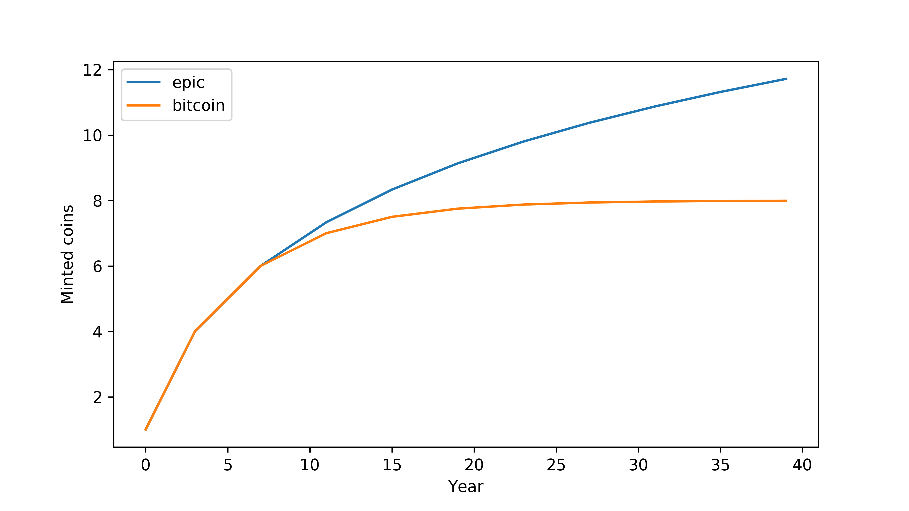

# Cryptocurrency

To demonstrate the feasibility and usability of our consensus mechanism design, we would like to build a cryptocurrency application based on it. Currency, which has come a long way and taken various form in our history, has been playing the following role in human society 

-   medium of exchange
-   unit of value
-   store of value

Unlike commodity money, e.g., gold or silver coins, which has its intrinsic value, or fiat money, which is backed by government credit, POW based cryptocurrency is built on computing time (CPU, GPU, ASICs) and electricity. 

## Medium of exchange

Given the high TPS (1024 transaction per second), we hope our system to be able to serve the functions of transactions to some extent. This project is not meant to replace the fiat currency or centralized electronic payment systems such as Alipay and WechatPay, since 1024 TPS is still relatively small compared to the volume of transactional activities in our society. The goal is to demonstrate that a decentralized, secure and fast payment system is not only possible but also can be scaled up given the technology our species have accumulated so far. 

## Incentive

Block reward and transaction fees incentivize nodes to support the network (by expanding computing resources and electricity). 

### Block reaward

As stated in the original bitcoin white paper, “The steady addition of a constant of amount of new coins is analogous to gold miners expending resources to add gold to circulation. “ However, this is not the case since bitcoin half the block reward approximately every four years in order to limit the total supply. The limited total supply certainly prevents inflation and the depreciation of the currency. Going forward, exponentially diminishing block reward causes a significant decrease of miner’s reward. In order to support the miners, transaction fees have to become the primary source of miners’ income gradually. This may likely make the system unattractive to users’ (those who want to use it as a medium of exchange).

We would like to propose a mild inflation model. To explain it, we use "year" as the time unit to show how the number of newly minted coins decreases over the time. However, the precise computation is according to the number of blocks, same as the bitcoin system. The first year, the total minted epic coins is roughly $$365\times 24\times 3600=31,536,000$$. In comparison, Bitcoin issued $$2,628,000$$ new coins in the first year. Scale both figures to one, the following table shows how the newly minted coins decreases year over year.

|  year   | 1-4  | 5-8  | 9-12 | 13-16 | 17-20 | 21-24 | 25-28 | 29-32 | 33-36 | 37-40 | 41-44 | 45-48 | 49-52 | 53-56 |
| :-----: | :--: | :--: | ---- | ----- | ----- | ----- | ----- | ----- | ----- | ----- | ----- | ----- | ----- | ----- |
| Bitcoin |  1   | 1/2  | 1/4  | 1/8   | 1/16  | 1/32  | 1/64  | 1/128 | 1/256 | 1/512 | 0     | 0     | 0     | 0     |
|  Epic   |  1   | 1/2  | 1/3  | 1/4   | 1/5   | 1/6   | 1/7   | 1/8   | 1/9   | 1/10  | 1/11  | 1/12  | 1/13  | 1/14  |

Such a scheme leads to a logarithm increase in the total supply. Note that logarithm infinite is quite “close” to finite, as shown in the following picture. This growth is much slower than exponential or linear increase.

We allow such a logarithm increase because:

-   Money loss (lost your private key, equivalent to accidentally washing your pants with 10000 USD in the pocket)
-   Miners will still be able to mint new coins every year, only a bit less than the previous year. If the price increase just a little bit, say a few percents, that guarantee miners would expect quite a stable, or even profitable return, year over year. 

