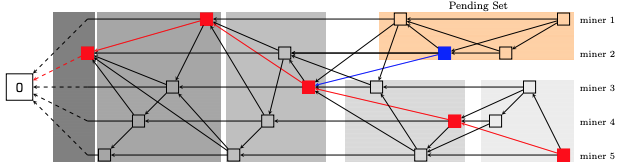

# Structured DAG

This is a basic guide on the main logic and properties of DAG. For detailed explanation, please refer to [research paper](https://arxiv.org/pdf/1901.02755.pdf).

The basic element in our structured DAG of course is the block. Here we do some abstraction for simplicity, only considering that a block contains three references to some other blocks in DAG, known as hash (or uint256 in code), nonce which is the solution to cryptographic puzzle and message it commits. Moreover, we give the name three references as milestone link, previous link and tip link.

## Proof of work

Solving cryptographic puzzle is also the proof of work in epic network. Note that a good solution requires the hash of the block having leading zeros. The number of leading zeros indicates the difficulty level of the solution. More zeros are, the puzzle is more likely to be harder to solve. Epic network has two dynamically changing difficulty level called *block difficulty* and *milestone difficulty* respectively. All the blocks in the DAG reach the block difficulty as compulsion. However, it is possible for each block to reach milestone difficulty, which is set more difficult than block difficulty. In this case we call it a milestone block. And milestone links must point to a milestone block or the genesis block.

## Peer chain

DAG in epic network requires each previous link pointing to the previous block the miner just mined. The figure below illustrates a typical scenario with 5 different miners. Blocks in each perpendicular line are mined by the same miner, who is also called a peer in epic network. We call the chain of block connected by previous link the *peer chain*. The first block in each peer chain points to the genesis block.

## Tip

Tip links are helpers in our DAG to increase connectivity among different peer chains. The only requirement for the tip link is to point to a regular block of another miner. However, epic reward scheme incentivizes the tip links pointing newest block as much as it can.

## Milestone and level set

We just mentioned that milestone links above which point to a milestone block. The milestone blocks as well as milestone links play an vitally important role in reaching consensus in DAG. There are two major functions of milestones, confirming level sets and connecting each level set. Level sets are analogous to the structure of blocks in Bitcoin. It contains many blocks which are equivalent to a single block in the view of Bitcoin. 

So it is important for DAG to partition blocks into level sets. We say a block is *confirmed* if it is pointed or linked either directly or indirectly by a milestone block. Hence when a milestone block is mined and added to DAG, a level set appears accordingly, consisting of blocks confirmed by this milestone block but not confirmed by old milestone blocks. In other words, if we call the collection of all the blocks in DAG not being confirmed as pending set, then a new level set contains blocks just confirmed by the milestone block in the pending set. As the following figure illustrates, the red blocks are milestones and the gray shaded areas represent the different level sets. The pending set is the orange rectangle area as these blocks have not been confirmed by any milestones.

