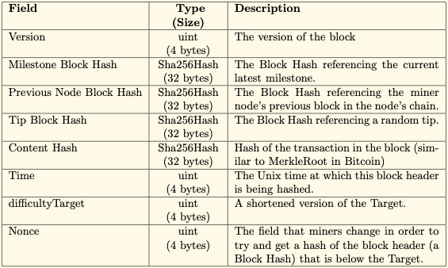

# Block

Each block contains only one transaction. There are 2 types of block: normal and milestone. 

## Types of Block

### Normal

- Most common type of block

* Approximately 0.001 seconds to mine each normal block

### Milestone

* Difficulty much higher than normal block

* Approximately 10 seconds to mine each Milestone

* A milestone class is a wrapper on a milestone block which contains information about the milestone chain at the current state. It contains the following information:

  * Cumulative chain work
  * Milestone difficulty target for the next milestone
  * Normal block difficulty target for future blocks with R1 linked to it
  * Last timestamp when difficulty target was updated
  * The instance/pointer of the block
  * A set of pointers to all blocks in its level set

  If a milestone is the head of a milestone chain, it also includes

  * A set of pointers to all the blocks pending for verification with regard to the confirmed blocks on the chain

  When a new milestone occurs, it calculates the difficulty target if it is the time for transition. Otherwise, it inherit the difficulty targets from the previous milestone. The set for pending blocks is also moved to it from its previous milestone.

## Structure

Each block has 3 pointers to 3 different blocks:

* Latest milestone block
* Previous node block in the peer chain
* Tip block

The pointers will connect to the Genesis block if those blocks cannot be found.

