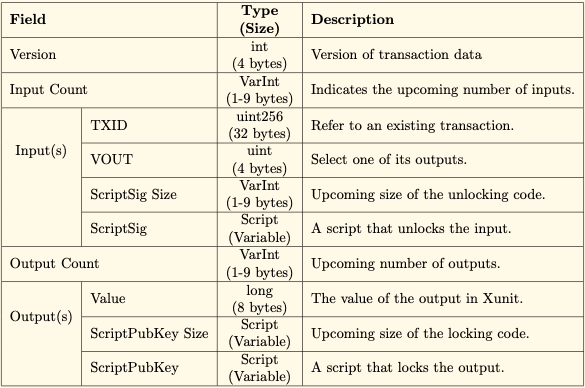

# Transaction

The structure of a transaction in EPI is very similar to Bitcoin's transaction. The difference lies in the ScriptSig in which EPI has simpler script. There are 3 types of transaction: normal, registration and redemption.

## Types of Transaction

### Normal

The structure of a typical transaction



### Registration and Redemption

Registration and Redemption are transactions that are automatically generated when peers decide to create a peer chain and redeem the block rewards. The purpose of Registration and Redemption transaction is to replace coinbase transaction used by Bitcoin. With huge mining traffic, the use of coinbase transaction generated for every new transaction is not efficient for data storage.

#### Registration

- The first block each miner creates will be a Registration transaction
- Distinguished by transaction input
- Does not contain transaction signature

#### Redemption

- Redemption transaction is created when miners want to claim the accumulated rewards
- Contain transaction input
- `Input = Total number of Block Reward + Transaction fee`  between the Redemption block and the latest Registration block \(Refer to Reward Scheme\)
- This will sum up the total reward that the miner will receive
- It requires the miner's private key to create this transaction


## Status

* Conditions for an invalid transaction:
  * Missing input or output for redemption of reward
  * Redeem value greater than reward
  * Double redemption
  * Number of sigOps is greater than `MAX_BLOCK_SIGOPS`
  * Signature failed
  * Transaction fees to large \(greater than `MAX_MONEY`\)
* Invalid transaction will catch exception and terminate
* Only valid transaction will be allowed to accumulate reward

This is an enum that describes the underlying reason the transaction was created. It's useful for rendering wallet GUIs more appropriately.

```java
public enum Status {
        UNKNOWN(0),
        VALID(1),
        INVALID(2);

        private int value;
        private static Map<Integer, Status> map = new HashMap<>();

        private Status(int value) {
            this.value = value;
        }

        static {
            for (Status Status : Status.values()) {
                map.put(Status.value, Status);
            }
        }

        public static Status valueOf(int Status) {
            return map.get(Status);
        }

        public int getValue() {
            return value;
        }
    }
```

